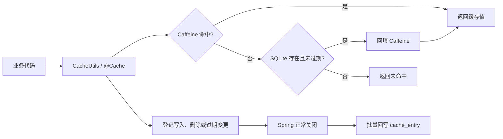
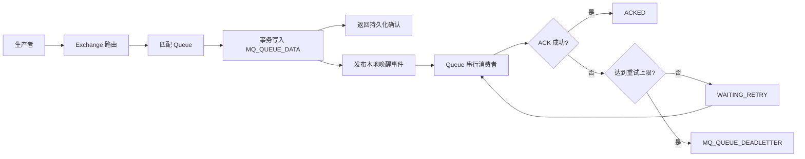

<div align="center">

# LocalCache

**基于 Caffeine 与 SQLite 的 Spring Boot 本地持久化缓存，并提供轻量级嵌入式消息队列能力。**

[](https://openjdk.org/)
[](https://spring.io/projects/spring-boot)
[](https://github.com/ben-manes/caffeine)
[](https://www.sqlite.org/)
[](https://baomidou.com/)
[](https://maven.apache.org/)
[](#项目状态与限制)

[核心特性](#核心特性) · [快速开始](#快速开始) · [缓存使用](#缓存使用) · [消息队列](#持久化消息队列) · [版本记录](#版本演进)

</div>

---

## 项目简介

LocalCache 是一个面向单体应用、桌面服务和轻量级后端服务的本地基础设施示例项目。项目将 [Caffeine](https://github.com/ben-manes/caffeine) 的进程内高速缓存与 [SQLite](https://www.sqlite.org/) 的本地持久化能力组合起来，在不部署 Redis、RabbitMQ 或 Kafka 等外部中间件的情况下，提供：

- 支持 TTL 的本地键值缓存；
- 应用重启后的缓存数据恢复；
- 基于注解和 Spring AOP 的方法级缓存；
- 基于 SQLite 的持久化消息投递、确认、重试和死信归档；
- DIRECT、FANOUT、TOPIC 三种消息路由模式；
- 统一异常响应和覆盖核心链路的测试示例。

本项目适合学习本地缓存持久化、AOP 方法缓存、SQLite 数据访问和嵌入式消息队列的实现方式，也可以作为低并发、单实例应用的基础组件原型。

> [!IMPORTANT]
> LocalCache 是嵌入到当前 Spring Boot 进程中的本地组件，不是 Redis、RabbitMQ、Kafka 等分布式中间件的替代品。需要多实例共享、跨主机通信、高吞吐、分区容错或完善运维生态时，应选择专业中间件。

## 目录

- [核心特性](#核心特性)
- [工作原理](#工作原理)
- [技术栈](#技术栈)
- [项目结构](#项目结构)
- [快速开始](#快速开始)
- [配置说明](#配置说明)
- [缓存使用](#缓存使用)
- [持久化消息队列](#持久化消息队列)
- [MQ 功能闭环校验](#mq-功能闭环校验)
- [示例 HTTP 接口](#示例-http-接口)
- [数据模型](#数据模型)
- [测试与构建](#测试与构建)
- [项目状态与限制](#项目状态与限制)
- [版本演进](#版本演进)
- [MQ 后续开发路线图](#mq-后续开发路线图)
- [后续规划](#后续规划)
- [Issue 提交规范](#issue-提交规范)
- [参与贡献](#参与贡献)
- [许可证](#许可证)

## 核心特性

### 本地持久化缓存

- 使用 Caffeine 提供低延迟的进程内缓存访问。
- 使用 SQLite `cache_entry` 表保存缓存值、创建时间、更新时间和过期时间。
- 支持永久缓存和按条目设置 TTL。
- 支持读取、写入、删除、存在判断、更新过期时间和查询剩余 TTL。
- 应用启动时恢复 SQLite 中尚未过期的数据。
- Caffeine 未命中时可从 SQLite 回源，适用于容量淘汰后的再次访问。
- 使用同步生命周期锁保证本地缓存和待持久化变更的操作顺序。
- 开启 Caffeine 统计信息，便于后续扩展监控能力。

### 方法级注解缓存

- 提供项目自定义 `@Cache` 注解。
- 支持通过 SpEL 表达式生成缓存键。
- 未配置键表达式时，根据目标类、方法签名和参数自动生成键。
- 使用 Jackson 序列化方法返回值，并根据方法泛型返回类型反序列化。
- 支持自定义 TTL；`ttlSeconds = 0` 表示永久缓存。
- 只缓存非空返回值，目标方法异常保持原样传播。

### 嵌入式可靠消息

- 支持 DIRECT、FANOUT、TOPIC 三种 Exchange 类型。
- Exchange、Queue、绑定关系、消息状态和死信记录均保存在 SQLite。
- 消息先完成数据库持久化，再返回生产确认结果。
- 同一个 Queue 串行消费，保证队内按数据库记录顺序处理。
- 不同 Queue 通过独立线程池并行调度。
- 支持 AUTO 和 MANUAL 两种 ACK 模式。
- 支持 ACK 超时恢复、消费异常重试和主动 NACK。
- 支持指数退避策略与最大延迟限制。
- 超过最大重试次数后，将消息归档到死信表。
- 应用启动和定时恢复任务会重新调度可执行消息。

### 工程能力

- Spring Boot MVC 分层结构。
- MyBatis-Plus 数据访问和事务控制。
- SQLite WAL 模式与单写连接配置，降低本地写锁竞争。
- 统一 `R<T>` 接口响应和全局异常处理。
- Maven Wrapper 提供一致的构建入口。
- 覆盖缓存配置、缓存切面、路由匹配、退避计算和示例接口等测试。

## 工作原理

### 缓存读写流程



缓存引擎启动后会先加载 SQLite 中的有效记录。写入、删除和 TTL 修改首先作用于内存缓存，并登记到待处理变更集合；Spring 容器正常销毁时，再批量写回 SQLite。

> [!WARNING]
> 当前普通缓存采用“内存更新 + 正常关闭时批量回写”的策略。进程被强制终止、机器断电或 JVM 异常退出时，尚未回写的变更可能丢失。如果业务要求每次写入都具备持久化确认，应在现有实现上增加同步落盘或周期刷盘机制。

### 消息投递流程



生产端会为每个匹配的 Queue 创建一条独立消息记录。消费端通过 Queue 级运行标志避免同一 Queue 并发执行，而不同 Queue 可以使用线程池并行消费。

## 技术栈

| 分类 | 技术 | 项目版本/来源 | 用途 |
| --- | --- | --- | --- |
| 运行环境 | Java | 17 | 项目编译目标与最低运行要求 |
| 核心框架 | Spring Boot | 4.1.1 | 应用启动、依赖管理、MVC 与配置体系 |
| Web | Spring Web MVC | 由 Spring Boot 管理 | 提供缓存测试接口和统一响应 |
| 切面 | Spring AOP + AspectJ Weaver | 由 Spring Boot 管理 | 实现 `@Cache` 方法拦截与数据权限切面骨架 |
| 本地缓存 | Caffeine | 由 Spring Boot 管理 | 内存缓存、TTL、容量控制和本地元数据缓存 |
| 数据访问 | MyBatis-Plus | 3.5.17 | SQLite 表的 Mapper、Service 与条件更新 |
| 数据库 | SQLite JDBC | 3.53.4.0 | 缓存与消息数据的本地持久化 |
| 状态机依赖 | Spring StateMachine | 4.0.0 | 已声明依赖，当前核心缓存/MQ 流程尚未使用 |
| JSON | Jackson 3 | 由 Spring Boot 管理 | 方法返回值、消息体和消息头序列化 |
| 辅助工具 | Lombok | 由 Spring Boot 管理 | 构造器、数据对象和日志注解 |
| 测试 | Spring Boot Test、JUnit、Mockito | 由 Spring Boot 管理 | 单元测试与 Spring 上下文测试 |
| 构建 | Maven Wrapper | Maven 3.6.3 | 依赖解析、测试、打包与运行 |

## 项目结构

```text
LocalCache/
├── db/                                      # 运行时 SQLite 数据文件
├── docs/specs/                              # 需求与文档设计说明
├── src/main/java/com/example/cache/
│   ├── annotation/                          # @Cache、@CacheMqListener、@DataScope
│   ├── aspect/                              # 方法缓存与数据权限切面
│   ├── config/                              # Caffeine、MQ、配置属性和自动填充
│   ├── controller/                          # HTTP 测试入口
│   ├── domain/
│   │   ├── cache/                           # 内存缓存值模型
│   │   ├── dto/                             # 请求对象
│   │   ├── entity/                          # SQLite 持久化实体
│   │   ├── enums/                           # MQ 类型、状态和 ACK 模式
│   │   ├── event/                           # Queue 唤醒事件
│   │   ├── mq/                              # MQ 发送、失败和确认上下文
│   │   └── vo/                              # 接口展示对象
│   ├── exception/                           # 业务异常与全局异常处理
│   ├── manager/mq/                          # MQ 生产者和消费者
│   ├── mapper/                              # MyBatis-Plus Mapper
│   ├── service/                             # 缓存与 MQ 业务服务
│   └── utils/                               # CacheUtils、CacheMqUtils、路由和退避工具
├── src/main/resources/
│   ├── db/                                  # 缓存表与 MQ 表初始化脚本
│   ├── mapper/                              # MyBatis XML 映射
│   └── application.yml                      # 应用、数据源、缓存和 MQ 配置
├── src/test/java/com/example/cache/          # 单元测试与上下文测试
├── pom.xml
├── mvnw
└── mvnw.cmd
```

### 核心组件职责

| 组件 | 职责 |
| --- | --- |
| `CacheConfig` | 创建并管理主 Caffeine 缓存，处理启动恢复、读穿透、TTL 和关闭回写 |
| `CacheUtils` | 提供普通缓存的统一 Java API |
| `CacheAspect` | 拦截 `@Cache` 方法，处理键生成、序列化、命中和回填 |
| `CacheEntryServiceImpl` | 批量应用缓存持久化新增、更新和删除 |
| `CacheMqUtils` | 声明 Exchange/Queue、建立绑定和发送消息 |
| `CacheMqProducer` | 序列化消息、完成路由、事务持久化并发布唤醒事件 |
| `CacheMqConsumer` | 扫描监听方法、串行消费 Queue、处理 ACK 与恢复调度 |
| `MqDefinitionServiceImpl` | 管理 Exchange、Queue、Binding 和路由匹配 |
| `MqMessageServiceImpl` | 管理消息状态、ACK、重试和死信归档 |

## 快速开始

### 环境要求

- JDK 17；也可以使用兼容的更高版本 JDK。
- Git。
- 无需单独安装 Maven，仓库已包含 Maven Wrapper。
- 无需单独安装 SQLite，项目通过 SQLite JDBC 驱动访问本地数据库文件。

先确认 Java 版本：

```bash
java -version
```

输出中的主版本应为 `17` 或更高。项目 `pom.xml` 的编译目标为 Java 17；使用 Java 8 会出现 `UnsupportedClassVersionError`。

### 获取项目

```bash
git clone https://github.com/Ddfff233/LocalCache.git
cd LocalCache
```

### 构建项目

Windows：

```powershell
.\mvnw.cmd clean package
```

Linux/macOS：

```bash
./mvnw clean package
```

### 启动应用

Windows：

```powershell
.\mvnw.cmd spring-boot:run
```

Linux/macOS：

```bash
./mvnw spring-boot:run
```

也可以运行打包产物：

```bash
java -jar target/cache-0.0.1-SNAPSHOT.jar
```

默认情况下，应用会：

1. 在 `./db/system.sqlite` 创建或打开 SQLite 数据库；
2. 开启 SQLite WAL 模式；
3. 初始化缓存表与 MQ 表；
4. 恢复有效缓存数据和可继续处理的 MQ 消息；
5. 使用 Spring Boot 默认端口 `8080` 提供测试接口。

## 配置说明

默认配置位于 `src/main/resources/application.yml`：

```yaml
spring:
  application:
    name: cache
  datasource:
    url: jdbc:sqlite:./db/system.sqlite?journal_mode=WAL&busy_timeout=5000&synchronous=NORMAL
    driver-class-name: org.sqlite.JDBC
    hikari:
      maximum-pool-size: 1
  sql:
    init:
      mode: always
      schema-locations:
        - classpath:db/data.sql
        - classpath:db/2026-09-30-Caffeine持久化MQ.sql

cache:
  max-size: 100000
  mq:
    ack-timeout: 30s
    recovery-interval: 1s
    dead-letter-queue: MQ_DEFAULT_DEAD_LETTER
    consumer:
      core-pool-size: 4
      max-pool-size: 16
      queue-capacity: 1000
    retry:
      max-attempts: 3
      initial-delay: 1s
      multiplier: 2
      max-delay: 30s
```

### 数据源配置

| 配置项 | 默认值 | 说明 |
| --- | --- | --- |
| `spring.datasource.url` | `jdbc:sqlite:./db/system.sqlite?...` | SQLite 文件位置及 WAL、锁等待和同步策略 |
| `spring.datasource.driver-class-name` | `org.sqlite.JDBC` | SQLite JDBC 驱动 |
| `spring.datasource.hikari.maximum-pool-size` | `1` | 将写连接限制为一个，减少 SQLite 锁竞争 |
| `spring.sql.init.mode` | `always` | 每次启动执行幂等建表脚本 |

### 缓存配置

| 配置项 | 默认值 | 说明 |
| --- | --- | --- |
| `cache.max-size` | `100000` | 主 Caffeine 缓存允许保留的最大条目数，必须大于 0 |

### MQ 配置

| 配置项 | 默认值 | 说明 |
| --- | --- | --- |
| `cache.mq.ack-timeout` | `30s` | 消息进入 PROCESSING 后等待确认的最长时间 |
| `cache.mq.recovery-interval` | `1s` | 扫描待投递、可重试和确认超时消息的周期 |
| `cache.mq.dead-letter-queue` | `MQ_DEFAULT_DEAD_LETTER` | 启动时创建并标记的默认死信 Queue 元数据名称 |
| `cache.mq.consumer.core-pool-size` | `4` | 消费线程池核心线程数 |
| `cache.mq.consumer.max-pool-size` | `16` | 消费线程池最大线程数 |
| `cache.mq.consumer.queue-capacity` | `1000` | 消费线程池任务队列容量 |
| `cache.mq.retry.max-attempts` | `3` | 首次投递失败后允许安排的最大重试次数 |
| `cache.mq.retry.initial-delay` | `1s` | 第一次重试等待时间 |
| `cache.mq.retry.multiplier` | `2` | 指数退避倍率 |
| `cache.mq.retry.max-delay` | `30s` | 单次重试等待时间上限 |

按默认配置，失败后的重试间隔依次为 `1s`、`2s`、`4s`。`max-attempts = 3` 表示首次投递之外最多再重试 3 次。

## 缓存使用

### 使用 `CacheUtils`

`CacheUtils` 是普通缓存的统一操作入口，缓存值类型为 `byte[]`。

```java
import com.example.cache.utils.CacheUtils;
import org.springframework.stereotype.Service;

import java.nio.charset.StandardCharsets;
import java.time.Duration;

@Service
public class UserTokenService {

    private final CacheUtils cacheUtils;

    public UserTokenService(CacheUtils cacheUtils) {
        this.cacheUtils = cacheUtils;
    }

    public void saveToken(Long userId, String token) {
        String key = "user:token:" + userId;
        cacheUtils.set(key, token.getBytes(StandardCharsets.UTF_8), Duration.ofMinutes(30));
    }

    public String getToken(Long userId) {
        byte[] value = cacheUtils.get("user:token:" + userId);
        return value == null ? null : new String(value, StandardCharsets.UTF_8);
    }

    public boolean deleteToken(Long userId) {
        return cacheUtils.delete("user:token:" + userId);
    }
}
```

可用方法：

| 方法 | 说明 |
| --- | --- |
| `get(String key)` | 获取缓存字节；不存在或已过期时返回 `null` |
| `set(String key, byte[] value)` | 写入永久缓存 |
| `set(String key, byte[] value, Duration ttl)` | 按 `Duration` 写入带 TTL 的缓存 |
| `set(String key, byte[] value, TimeUnit unit, long timeout)` | 按时间单位和数值写入带 TTL 的缓存 |
| `delete(String key)` | 删除缓存，返回删除前是否存在 |
| `hasKey(String key)` | 判断有效缓存是否存在 |
| `expire(String key, Duration ttl)` | 更新已有缓存的 TTL |
| `getExpire(String key)` | 查询剩余 TTL；不存在返回 `null`，永久缓存返回 `Duration.ZERO` |

缓存键不能为空，缓存值不能为 `null`，TTL 必须大于 0。

### 使用 `@Cache` 方法缓存

```java
import com.example.cache.annotation.Cache;
import org.springframework.stereotype.Service;

@Service
public class UserQueryService {

    @Cache(key = "'user:profile:' + #userId", ttlSeconds = 300)
    public UserProfile getUserProfile(Long userId) {
        return loadUserProfileFromDatabase(userId);
    }

    private UserProfile loadUserProfileFromDatabase(Long userId) {
        return new UserProfile(userId, "示例用户");
    }

    public record UserProfile(Long id, String name) {
    }
}
```

`@Cache` 属性：

| 属性 | 默认值 | 说明 |
| --- | --- | --- |
| `key` | 空字符串 | SpEL 缓存键表达式；为空时根据目标类、方法和参数自动生成 |
| `ttlSeconds` | `300` | 缓存有效期秒数；`0` 表示永久缓存，不能为负数 |

使用限制：

- 被注解方法必须有返回值，不能返回 `void`。
- 返回值和自动键中的参数必须能够被 Jackson 序列化。
- `null` 返回值不会写入缓存。
- 与其他基于代理的 Spring AOP 功能相同，同一个 Bean 内部的自调用不会经过代理切面。

## 持久化消息队列

### 路由类型

| 类型 | 匹配规则 | 示例 |
| --- | --- | --- |
| `DIRECT` | Binding Key 与 Routing Key 完全相等 | `order.created` 匹配 `order.created` |
| `FANOUT` | 忽略 Routing Key，投递给该 Exchange 的全部绑定 Queue | 广播配置刷新事件 |
| `TOPIC` | 以 `.` 分段，`*` 匹配一个单词，`#` 匹配零个或多个单词 | `order.*`、`order.#` |

### 声明 Exchange、Queue 与绑定

声明方法具备幂等语义：已存在且配置一致时会复用现有记录。

```java
import com.example.cache.domain.enums.CacheMqExchangeType;
import com.example.cache.utils.CacheMqUtils;
import jakarta.annotation.PostConstruct;
import org.springframework.stereotype.Component;

@Component
public class OrderMqInitializer {

    private final CacheMqUtils cacheMqUtils;

    public OrderMqInitializer(CacheMqUtils cacheMqUtils) {
        this.cacheMqUtils = cacheMqUtils;
    }

    @PostConstruct
    public void initialize() {
        cacheMqUtils.declareExchange("order.exchange", CacheMqExchangeType.TOPIC);
        cacheMqUtils.declareQueue("order.created.queue");
        cacheMqUtils.bind("order.created.queue", "order.exchange", "order.created.*");
    }
}
```

FANOUT Exchange 的绑定键会被规范化为空字符串；DIRECT 和 TOPIC 的绑定键不能为空。

### 发送消息

```java
import com.example.cache.domain.mq.CacheMqSendResult;
import com.example.cache.utils.CacheMqUtils;
import org.springframework.stereotype.Service;

import java.util.Map;

@Service
public class OrderEventPublisher {

    private final CacheMqUtils cacheMqUtils;

    public OrderEventPublisher(CacheMqUtils cacheMqUtils) {
        this.cacheMqUtils = cacheMqUtils;
    }

    public CacheMqSendResult publish(Long orderId) {
        OrderCreatedMessage message = new OrderCreatedMessage(orderId, System.currentTimeMillis());
        return cacheMqUtils.send(
                "order.exchange",
                "order.created.cn",
                message,
                Map.of("source", "order-service")
        );
    }

    public record OrderCreatedMessage(Long orderId, Long createdAt) {
    }
}
```

发送结果 `CacheMqSendResult` 包含：

| 字段 | 说明 |
| --- | --- |
| `messageId` | 消息 UUID |
| `confirmed` | 消息是否完成本地持久化确认 |
| `routedQueueCount` | 匹配并写入消息记录的 Queue 数量 |
| `confirmedAt` | 持久化确认时间戳 |

消息体不能为空，Exchange 必须存在且启用，消息至少需要匹配一个 Queue，否则会抛出业务异常。

### AUTO 自动确认

AUTO 模式是默认模式。监听方法必须是 `public`，并且只能包含一个消息参数。方法正常返回后消息转为 `ACKED`；抛出异常时进入重试流程。

```java
import com.example.cache.annotation.CacheMqListener;
import org.springframework.stereotype.Component;

@Component
public class OrderAutoConsumer {

    @CacheMqListener(queue = "order.created.queue")
    public void handle(OrderCreatedMessage message) {
        System.out.println("收到订单消息：" + message.orderId());
    }

    public record OrderCreatedMessage(Long orderId, Long createdAt) {
    }
}
```

### MANUAL 手动确认

MANUAL 模式的第二个参数必须是 `CacheMqAckContext`。业务处理成功后调用 `ack()`；希望进入失败重试时调用 `nack()` 或 `nack(reason)`。

```java
import com.example.cache.annotation.CacheMqListener;
import com.example.cache.domain.enums.CacheMqAckMode;
import com.example.cache.domain.mq.CacheMqAckContext;
import org.springframework.stereotype.Component;

@Component
public class OrderManualConsumer {

    @CacheMqListener(queue = "order.created.queue", ackMode = CacheMqAckMode.MANUAL)
    public void handle(OrderCreatedMessage message, CacheMqAckContext context) {
        if (processOrder(message)) {
            context.ack();
            return;
        }
        context.nack("订单处理失败");
    }

    private boolean processOrder(OrderCreatedMessage message) {
        return message.orderId() != null;
    }

    public record OrderCreatedMessage(Long orderId, Long createdAt) {
    }
}
```

同一个 Queue 只能声明一个监听方法。手动监听方法返回时如果既未 ACK 也未 NACK，消息会保持 PROCESSING，待 ACK 超时后由恢复任务转入重试流程。

### 消息状态

| 状态 | 含义 |
| --- | --- |
| `PENDING` | 已持久化，等待首次消费 |
| `PROCESSING` | 已分配给消费者，等待 ACK/NACK 或超时 |
| `WAITING_RETRY` | 消费失败，等待下一次重试时间 |
| `ACKED` | 消费成功并完成确认 |
| `DEAD_LETTER` | 超过最大重试次数，已归档到死信表 |

## MQ 功能闭环校验

本节以“声明 → 路由 → 持久化 → 消费 → 确认 → 重试 → 死信 → 恢复”为完整链路，对当前 MQ 能力进行核验。状态含义如下：

- ✅ **已闭环**：存在完整实现，并有直接测试或可由事务和调用链明确验证。
- 🟡 **部分闭环**：已有基础实现，但缺少关键测试、管理入口或生产治理能力。
- ⬜ **待建设**：当前尚未形成可使用的完整能力。

| 闭环阶段 | 当前实现 | 验证依据 | 状态 | 遗留问题 |
| --- | --- | --- | --- | --- |
| Exchange、Queue 声明 | 支持声明、同名复用和同名 Exchange 类型一致性检查 | `MqDefinitionServiceImpl.declareExchange`、`declareQueue`；数据库唯一索引 | ✅ 已闭环 | 建议补充重复声明的专项回归测试 |
| Binding 管理 | 支持 Queue 与 Exchange 绑定，重复绑定不会重复插入 | `MqDefinitionServiceImpl.bind`；`uk_mq_binding` 唯一索引 | ✅ 已闭环 | 暂无解绑和 Binding 查询接口 |
| DIRECT/FANOUT/TOPIC 路由 | 支持精确、广播和通配符路由；同一 Queue 多次命中只生成一份消息 | `CacheMqRoutingMatcherTest`；`routesFanoutAndTopicMessagesWithoutDuplicateQueueData` | ✅ 已闭环 | 暂无路由规则在线检查工具 |
| 消息序列化与持久化 | 消息体、类型和消息头序列化后，为每个目标 Queue 事务写入 `MQ_QUEUE_DATA` | `CacheMqProducer`、`MqMessageServiceImpl.createQueueData` | ✅ 已闭环 | 消息头尚不能直接注入监听方法 |
| 生产确认 | 所有目标 Queue 消息记录保存成功后返回 `CacheMqSendResult`，随后发布本地唤醒事件 | `sendsPersistentMessageAndConsumesAsynchronously` | ✅ 已闭环 | 尚无可配置的发送超时和批量发送 |
| Queue 异步消费 | 使用线程池调度，Queue 级 `AtomicBoolean` 防止同一 Queue 并发执行 | `CacheMqConsumer.scheduleQueue`、`consumeQueue` | 🟡 部分闭环 | 缺少不同 Queue 并行时序和线程池饱和测试 |
| 单 Queue FIFO | 按 Queue、状态和记录 ID 查询队首，同一 Queue 串行处理 | `MqQueueDataMapper.selectHead`；`preservesFifoWithinQueue` | ✅ 已闭环 | 长时间失败的队首消息会阻塞该 Queue 后续消息，这是当前 FIFO 语义 |
| AUTO ACK | 监听方法正常返回后更新为 `ACKED`，异常进入失败流程 | `CacheMqConsumer.deliver`；异步消费集成测试 | ✅ 已闭环 | ACK 数据库更新失败时可能再次投递，消费者必须保证幂等 |
| MANUAL ACK/NACK | 通过 `CacheMqAckContext` 显式确认或拒绝，重复确认由上下文阻止 | `supportsManualAck`；`CacheMqAckContext` | ✅ 已闭环 | 尚无统一的消息元数据上下文 |
| ACK 超时与过期确认 | 未确认消息超时后进入失败流程；旧投递令牌不能确认新一轮投递 | `treatsMissingManualAckAsFailureAndEventuallyDeadLetters`；`rejectsAckFromExpiredDeliveryAttempt` | ✅ 已闭环 | 缺少超时次数和延迟分布指标 |
| 指数退避重试 | 失败后按配置计算下一次重试时间，默认间隔为 1、2、4 秒 | `ExponentialBackoffUtilsTest`；`MqMessageServiceImpl.handleFailure` | ✅ 已闭环 | 尚无按异常类型区分“可重试/不可重试”的策略 |
| 死信转换 | 达到重试上限后，在同一事务中写入 `MQ_QUEUE_DEADLETTER` 并将原消息标记为 `DEAD_LETTER` | `movesMessageToIndependentDeadLetterTableAfterThreeRetries` | ✅ 已闭环 | 缺少死信查询、重放、丢弃和审计操作入口 |
| 启动与定时恢复 | 启动后及定时任务扫描 PENDING、到期 WAITING_RETRY 和超时 PROCESSING 消息 | `CacheMqConsumer.afterSingletonsInstantiated`、`recoverQueues`、`selectRecoverableQueueNames` | 🟡 部分闭环 | 缺少真实进程异常退出并重启的端到端测试 |
| 消费幂等 | 当前没有内置业务幂等键或消费记录 | 无 | ⬜ 待建设 | 至少一次投递下可能重复执行业务副作用 |
| 消息生命周期治理 | ACKED 和 DEAD_LETTER 数据持续保留 | 无自动清理实现 | ⬜ 待建设 | 缺少保留期、归档、批量清理和清理审计 |
| 管理与可观测性 | 当前主要依赖应用日志和数据库查询 | 无管理 API、指标或页面 | ⬜ 待建设 | 缺少堆积量、成功率、重试数、死信数和消费耗时指标 |

### 闭环结论

当前版本已经完成基础消息投递和失败处理闭环：消息可以完成声明、路由、持久化、消费、确认、重试、死信归档和定时恢复。现有集成测试覆盖 AUTO/MANUAL ACK、FIFO、路由去重、重试死信、确认超时和过期 ACK 等核心场景。

但当前尚未完成生产级治理闭环，主要缺口是消费幂等、真实崩溃恢复测试、死信重放、历史数据清理、管理接口、配置校验和运行指标。因此，在这些能力完成前，更适合作为单实例、低并发和可控业务范围内的嵌入式 MQ 使用。

> [!WARNING]
> 当前投递语义接近“至少一次”。如果监听方法已经完成业务写入，但 MQ 的 ACK 状态更新失败，消息可能在超时恢复后再次投递。接入方必须使用业务唯一键、数据库唯一约束或幂等记录，保证重复投递不会造成重复扣款、重复发货等业务副作用。

## 示例 HTTP 接口

仓库包含三个用于验证缓存能力的测试接口。

### 验证方法级缓存

```http
GET /cache/test/{id}
```

```bash
curl http://localhost:8080/cache/test/1
```

该接口使用缓存键 `cache:test:{id}`，TTL 为 60 秒。60 秒内重复访问相同 `id`，响应中的 `generatedAt` 应保持不变。

响应示例：

```json
{
  "code": 0,
  "message": "success",
  "data": {
    "id": 1,
    "generatedAt": 1791424800000
  },
  "timestamp": "2026-10-08T02:00:00Z"
}
```

### 写入字符串缓存

```http
POST /cache/test/set
Content-Type: application/json
```

```bash
curl -X POST http://localhost:8080/cache/test/set \
  -H "Content-Type: application/json" \
  -d '{"key":"demo:name","value":"LocalCache"}'
```

当前 Service 实现会为该测试接口写入 10 秒 TTL。

### 读取字符串缓存

```http
GET /cache/test/get?key={key}
```

```bash
curl "http://localhost:8080/cache/test/get?key=demo:name"
```

缓存不存在、已过期或参数无效时，接口通过统一异常处理返回失败响应。

### 统一响应结构

```json
{
  "code": 0,
  "message": "success",
  "data": {},
  "timestamp": "2026-10-08T02:00:00Z"
}
```

| 字段 | 类型 | 说明 |
| --- | --- | --- |
| `code` | `int` | `0` 表示成功，其他值表示业务或系统错误 |
| `message` | `string` | 响应说明 |
| `data` | `T` | 实际响应数据；失败时通常为 `null` |
| `timestamp` | `Instant` | 响应生成时间 |

## 数据模型

### 缓存表

| 表名 | 作用 | 关键字段 |
| --- | --- | --- |
| `cache_entry` | 保存普通缓存数据 | `key`、`value`、`expire_at`、`create_at`、`update_at` |

`expire_at` 使用毫秒时间戳，`NULL` 表示永久缓存。项目为该字段建立了过期时间索引。

### MQ 表

| 表名 | 作用 | 关键内容 |
| --- | --- | --- |
| `MQ_EXCHANGE` | Exchange 定义 | 名称、类型、启用状态、逻辑删除 |
| `MQ_QUEUE` | Queue 定义 | 名称、死信标志、启用状态、逻辑删除 |
| `MQ_QUEUE_EXCHANGE` | Queue 与 Exchange 的绑定关系 | Queue、Exchange、Routing Key |
| `MQ_QUEUE_DATA` | 普通消息及投递状态 | 消息体、状态、重试次数、ACK 截止时间、投递令牌 |
| `MQ_QUEUE_DEADLETTER` | 死信归档 | 原消息、失败原因、重试次数、死信时间 |

MQ 表采用 `del_flag` 逻辑删除字段：`0` 表示未删除，`1` 表示已删除。实体通过 MyBatis-Plus 自动填充 `create_at` 和 `update_at`。

## 测试与构建

使用 JDK 17 或更高版本运行完整测试：

Windows：

```powershell
.\mvnw.cmd test
```

Linux/macOS：

```bash
./mvnw test
```

执行打包但跳过测试：

```bash
./mvnw clean package -DskipTests
```

主要测试范围：

- `CacheConfigTest`：缓存生命周期、TTL、读穿透和回写；
- `CacheAspectTest`：SpEL 键、自动键、序列化和异常处理；
- `CacheUtilsTest`：缓存统一 API；
- `CacheMqRoutingMatcherTest`：DIRECT、FANOUT、TOPIC 路由；
- `ExponentialBackoffUtilsTest`：退避计算与同步重试；
- `CacheTestControllerTest`：HTTP 测试接口；
- `CacheMqApplicationTests`：MQ 表初始化、持久化发送、AUTO/MANUAL ACK、FIFO、路由去重、重试死信、确认超时和过期 ACK。

> [!NOTE]
> 当前仓库的测试代码与最新示例 Service 存在两处已知不同步：`CacheTestServiceImpl` 已改为调用带 10 秒 TTL 的 `CacheUtils.set` 重载，但对应测试仍校验永久缓存重载。在当前代码状态下，完整测试共执行 56 项，其中 54 项通过、2 项失败。该问题不影响 README 内容，但在正式发布前应同步测试预期或确认示例接口的目标行为。

## 项目状态与限制

当前项目处于开发阶段，建议在接入业务前关注以下边界：

1. **单实例定位**：缓存和 MQ 使用本地内存与本地 SQLite，不支持多个应用实例之间自动共享状态。
2. **缓存回写时机**：普通缓存变更主要在 Spring 正常关闭时批量持久化，异常退出可能丢失待回写数据。
3. **SQLite 并发能力**：当前连接池最大连接数为 1，优先保证单写稳定性，不适合高并发写入场景。
4. **消息序列化**：消息使用 Jackson JSON 序列化，生产端与消费端需要保持兼容的数据结构。
5. **至少一次投递**：ACK 更新失败或进程在业务处理后异常退出时，消息可能再次投递，业务消费者必须实现幂等。
6. **消息头访问**：消息头已经持久化，但监听方法当前只能直接接收消息体和手动确认上下文。
7. **恢复验证**：启动与定时恢复逻辑已经实现，但尚缺少真实进程崩溃后重启的端到端测试。
8. **消息清理**：ACKED、DEAD_LETTER 等历史数据尚未提供自动归档或定时清理策略。
9. **默认死信 Queue**：应用会初始化默认死信 Queue 元数据；当前失败消息实际归档在 `MQ_QUEUE_DEADLETTER` 表中，不会再次投递给该 Queue 的监听方法。
10. **管理与指标**：尚无 MQ 管理 API、管理页面和 Micrometer/Actuator 指标。
11. **配置校验**：MQ 配置属性尚未通过 Jakarta Validation 限制非法超时时间、线程数和重试参数。
12. **数据权限切面**：`@DataScope` 和 `DataScopeAspect` 目前仅为基础骨架，尚未形成可直接使用的数据权限方案。
13. **状态机依赖**：项目声明了 Spring StateMachine，但当前缓存和 MQ 核心流程未使用该依赖。
14. **接口校验**：示例 DTO 尚未使用 Jakarta Validation 注解，主要用于功能演示。
15. **测试差异**：当前存在 2 项与示例缓存 TTL 调整相关的既有测试失败。

仓库包含本地 SQLite 数据文件。用于真实项目时，建议根据部署方式重新规划数据库目录、备份策略和 Git 忽略规则，避免提交业务数据、WAL 或 SHM 文件。

## 版本演进

> 仓库当前没有正式 Git Tag。除提交信息明确标注的 `v1.1.0` 外，下列版本号根据 Git 提交顺序和功能阶段归纳，用于形成清晰的文档化版本历史。

### v1.2.1 — MQ 完善版

对应提交：[`45ebf51`](https://github.com/Ddfff233/LocalCache/commit/45ebf513a4c034f7aa42f57a24aa6d4f7027a039)（2026-09-30）

- 完善 MQ 消费线程池、元数据缓存和 Queue 运行状态缓存。
- 增加定时恢复与应用启动恢复机制。
- 完善 ACK 截止时间、投递令牌和状态条件更新。
- 补充 `CacheMqUtils` 统一操作入口。
- 增加可配置的 ACK 超时、恢复周期、死信 Queue、线程池和重试参数。
- 清理早期占位的 MQ Manager 类。

### v1.2.0 — 持久化 MQ

对应提交：[`ab7b216`](https://github.com/Ddfff233/LocalCache/commit/ab7b216fa9e65555a4c8c9c8fbbdf76f6c9a4a15)（2026-09-30）

- 新增 Exchange、Queue、Binding、消息和死信领域模型。
- 新增 DIRECT、FANOUT、TOPIC 路由。
- 新增 AUTO、MANUAL ACK 模式。
- 新增消息持久化、异步消费、失败重试和死信转移。
- 新增 Queue 唤醒事件与消息恢复查询。
- 新增指数退避和 Routing Key 匹配工具。
- 新增 MQ 表结构与 Mapper。

### v1.1.0 — 方法缓存增强版

对应提交：[`6d79fab`](https://github.com/Ddfff233/LocalCache/commit/6d79fab0d7348a90d8c17f67258107d85a25990f)（2026-09-30）

- 完善 `@Cache` 注解和 `CacheAspect`。
- 支持 SpEL 缓存键与自动缓存键。
- 支持方法返回值 JSON 序列化与泛型反序列化。
- 补充缓存 TTL、过期处理、统一工具方法和异常转换。
- 新增 `@DataScope` 与数据权限切面骨架。
- 调整业务异常包结构与全局异常处理。

### v1.0.1 — 缓存接口完善版

对应提交：[`94807ec`](https://github.com/Ddfff233/LocalCache/commit/94807ec3722c55d97c8b1abe212182c6828b628e)（2026-09-30）

- 新增缓存测试 Controller、Service、DTO 和 VO。
- 打通普通缓存写入、读取和方法缓存验证接口。
- 补充 Maven Wrapper 下载支持与本地 SQLite 运行文件。

### v1.0.0 — 项目初始化

对应提交：[`94165b5`](https://github.com/Ddfff233/LocalCache/commit/94165b5b96a01278c0512bf0aae26315d580f248)（2026-09-30）

- 初始化 Spring Boot 与 Maven 项目。
- 引入 Caffeine、SQLite JDBC、MyBatis-Plus、Spring AOP 和 Lombok。
- 建立 Caffeine + SQLite 本地持久化缓存基础结构。
- 新增缓存实体、Mapper、Service、配置和统一响应模型。
- 新增缓存表初始化脚本和基础异常处理。

### 版本说明

- 当前 `pom.xml` 中的 Maven Artifact 版本仍为 `0.0.1-SNAPSHOT`。
- 上述 `v1.x` 版本用于描述功能演进，尚未同步为 Maven Artifact 版本或 GitHub Release。
- 后续发布时建议同步维护 Git Tag、GitHub Release、CHANGELOG 和 `pom.xml` 版本。

## MQ 后续开发路线图

> [!IMPORTANT]
> 以下内容是后续开发规划，不代表当前版本已经实现。实际开发顺序可以根据 [GitHub Issues](https://github.com/Ddfff233/LocalCache/issues) 中的问题严重程度、使用需求和社区反馈调整。

### P0：可靠性与数据治理

| 开发项 | 目标 | 验收标准 |
| --- | --- | --- |
| MQ 配置校验 | 为 ACK 超时、恢复周期、线程池和重试参数增加启动期校验 | 零值、负数、线程数倒置和非法倍率会阻止应用启动，并返回明确的中文配置错误 |
| 消费幂等机制 | 提供业务幂等键和消费记录，降低至少一次投递带来的重复副作用 | 同一消息或同一业务幂等键重复投递时，业务副作用只执行一次；幂等记录与业务事务边界清晰 |
| 消息保留与清理 | 为 ACKED、DEAD_LETTER 消息增加可配置保留期和批量清理任务 | 不清理 PENDING、PROCESSING、WAITING_RETRY；每批数量可配置；输出清理数量、耗时和失败日志 |
| 死信管理 | 提供死信分页查询、详情、重放和丢弃能力 | 支持按 Queue、消息标识和时间查询；重放生成可追踪的新投递记录；原死信审计记录不可被覆盖 |
| 崩溃恢复测试 | 验证进程异常退出后的消息恢复 | 自动化测试覆盖 PENDING、PROCESSING、WAITING_RETRY 三种状态，重启后无消息永久丢失且状态迁移符合预期 |

### P1：管理与可观测性

| 开发项 | 目标 | 验收标准 |
| --- | --- | --- |
| 消息与 Queue 查询 API | 提供队列、消息和状态的分页查询能力 | 支持按 Queue、状态、消息标识和时间范围筛选；接口复用统一响应和异常体系 |
| Queue 暂停与恢复 | 允许运维人员临时停止和恢复指定 Queue | 暂停后不启动新投递；恢复后从队首继续消费；不破坏原有 FIFO 顺序 |
| MQ 运行指标 | 接入 Micrometer/Actuator 或项目统一指标体系 | 可观察 Queue 堆积量、消费成功率、重试次数、死信数量、消费耗时和线程池状态 |
| 消息消费上下文 | 向监听方法提供消息标识、Routing Key 和 Headers | AUTO/MANUAL 模式都能读取只读元数据；不破坏现有只接收消息体的方法签名 |
| 并发与饱和测试 | 验证 Queue 隔离、FIFO 和线程池拒绝场景 | 证明同 Queue 最大并发为 1、不同 Queue 可以并行；线程池饱和后消息仍可由恢复任务再次调度 |

### P2：扩展能力

| 开发项 | 目标 | 验收标准 |
| --- | --- | --- |
| 消息 TTL | 支持消息级或 Queue 级有效期 | 过期消息不会进入业务监听；过期状态、原因和处理策略可查询 |
| 延迟消息 | 支持指定时间后首次投递 | 未到投递时间不会占用消费者；应用重启后仍能按计划恢复 |
| 消息优先级 | 支持有限优先级范围 | 高优先级优先消费；相同优先级继续按 ID 保持 FIFO |
| 批量发送与确认 | 降低大量消息逐条操作的开销 | 批量事务边界明确；部分失败策略可配置；返回每条消息的确认结果 |
| MQ 管理页面 | 提供可选的 Queue、消息、死信和指标界面 | 页面只调用管理 API；危险操作需要二次确认；敏感消息体默认脱敏 |

## 后续规划

- [ ] 将普通缓存回写策略扩展为可配置的同步、定时和关闭回写模式。
- [ ] 增加缓存命中率、容量和过期数监控。
- [ ] 完成 `@DataScope` 数据权限实现，或移除未使用骨架。
- [ ] 评估并清理当前未使用的 Spring StateMachine 依赖。
- [ ] 建立正式版本、Git Tag、GitHub Actions 和发布流程。

## Issue 提交规范

使用过程中发现 Bug、文档问题，或希望提出 MQ 新功能和使用咨询时，请统一通过 GitHub Issues 提交：

- [查看已有 Issues](https://github.com/Ddfff233/LocalCache/issues)
- [新建 Issue](https://github.com/Ddfff233/LocalCache/issues/new)

提交前请先搜索现有 Issues，避免重复问题。建议 Issue 标题采用 `[类型] 简要问题描述`，类型可使用 `Bug`、`Feature`、`Docs` 或 `Question`。

### 通用信息

Issue 至少需要包含：

1. Issue 类型：Bug、功能建议、文档问题或使用咨询；
2. 项目版本、Git 提交号或所用分支；
3. Java 版本、操作系统和 SQLite 数据源配置；
4. 清晰的问题描述和影响范围；
5. 可以直接执行的最小复现步骤；
6. 期望结果与实际结果；
7. 相关日志、完整异常堆栈或最小复现代码；
8. 问题是否能够稳定复现，以及大致复现概率。

### MQ 问题补充信息

MQ 相关 Issue 还应尽量提供：

- Exchange 类型与 Exchange 名称；
- Queue 名称；
- Binding Key 与实际 Routing Key；
- AUTO 或 MANUAL ACK 模式；
- 消息当前状态：PENDING、PROCESSING、WAITING_RETRY、ACKED 或 DEAD_LETTER；
- 当前重试次数、下一次重试时间和最后一次错误；
- 是否发生应用重启、强制终止、线程池拒绝或 SQLite 锁等待；
- 可以复现问题的脱敏消息结构。

可以复制以下内容作为 Issue 描述起点：

```markdown
### Issue 类型

Bug / Feature / Docs / Question

### 环境信息

- 项目版本或提交号：
- Java 版本：
- 操作系统：
- SQLite 数据源配置：

### 问题描述

请说明问题、影响范围和发生时间。

### 复现步骤

1. 准备复现环境和测试数据。
2. 执行触发问题的操作。
3. 记录实际结果和出现问题的时间点。

### 期望结果

请说明正确行为。

### 实际结果

请说明实际行为，并附日志或异常堆栈。

### MQ 信息（非 MQ 问题可删除）

- Exchange 类型/名称：
- Queue：
- Binding Key：
- Routing Key：
- ACK 模式：
- 消息状态：
- 重试次数：
- 是否发生重启或异常退出：

### 复现稳定性

必现 / 偶现，概率约为：
```

> [!CAUTION]
> 提交 Issue 前必须对日志、配置和消息内容进行脱敏。请勿公开密码、访问令牌、密钥、完整身份证号、手机号、银行卡号或真实业务消息体。安全漏洞也不要附带可直接利用的真实生产凭据。

## 参与贡献

问题反馈和功能建议请优先通过 [GitHub Issues](https://github.com/Ddfff233/LocalCache/issues) 提交；已经明确解决方案的代码改进可以提交 Pull Request。建议遵循以下流程：

1. Fork 本仓库并从最新分支创建功能分支；
2. 修改前先确认现有分层、公共工具和异常体系；
3. 保持改动范围聚焦，避免无关重构和批量格式化；
4. 为新增功能或缺陷修复补充对应测试；
5. 使用 JDK 17 或更高版本运行 `mvnw test`；
6. 在 Pull Request 中说明修改目的、实现方式、验证结果和兼容性影响。

## 许可证

本仓库当前尚未声明开源许可证。在许可证文件正式加入仓库前，默认著作权仍归项目作者所有；如需复制、分发、修改或用于商业项目，请先获得作者授权。

---

<div align="center">

如果这个项目对你有帮助，欢迎在 [GitHub 仓库](https://github.com/Ddfff233/LocalCache) 中提交反馈。

</div>
